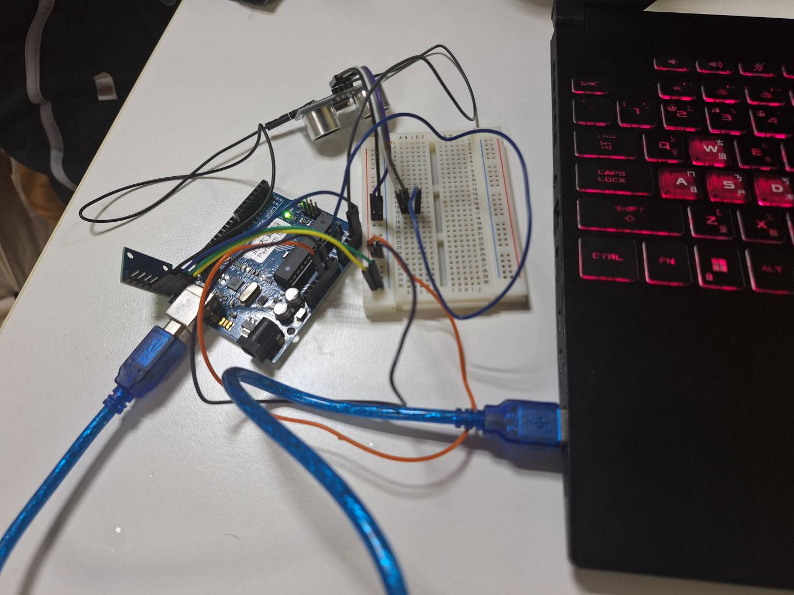
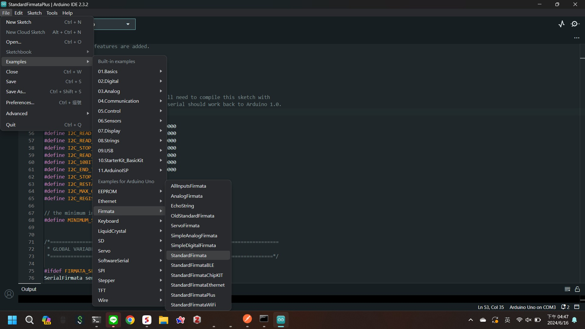
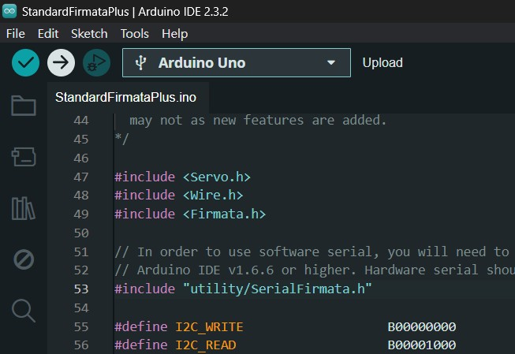
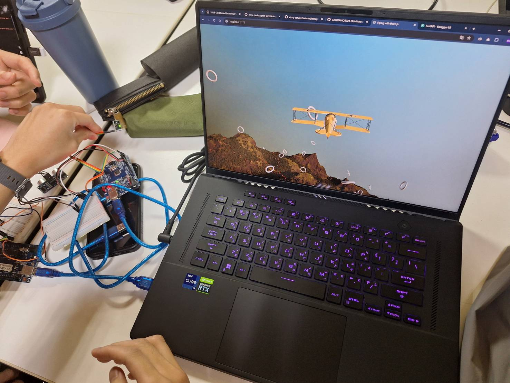

# Arduino device
## Devices
- make sure you connect arduino and sensor on the right ping
- connect the arduino device to the computer

## Arduino IDE
- open your arduino ide
- select the example of standardfirmetaPlus

- upload the example script to the arduino device
- when the LED stop flickering, it means the script finish uploading

## Node.js
- change to the `./device` directory
- `npm install`
- `.\node_modules\.bin\interchange install hc-sr04 -a uno -p <port> --firmata`
or `interchange install hc-sr04 -a uno -p <port> --firmata`
- `<port>` is the port of Arduino devices, ex: `COM3`
if there is any problem, checkup this website:
 https://johnny-five.io/api/proximity/#pingfirmata

## Demo
- `node ./device.js` to execute the device.js 
- Start the game and Enjoy your airplane simulator!
